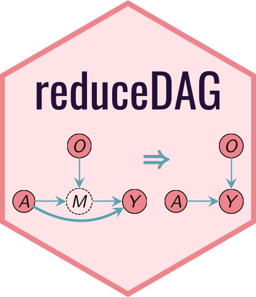

# reduceDAG
**Reduced DAG and g-formula for efficient estimation of average causal effects**

Directed acyclic graphs (DAGs) are widely used to represent structural assumptions for causal inference. Given a causal DAG, for estimating the effect of treatment A on outcome Y, the counterfactual mean of Y(a) can be identified by the well-known g-formula ([Robins, 1986](https://doi.org/10.1016/0270-0255(86)90088-6)). However, perhaps surprisingly, not every variable that appears in the DAG (or the g-formula) carries information for estimating the counterfactual mean (or the effect).

`reduceDAG` is an R package that identifies all the uninformative variables from a DAG. Further, by projecting out these variables, it returns a reduced DAG that encapsulates information required for identifying and optimally estimating an average causal effect (of a point intervention). Accordingly, a reduced g-formula is derived from the reduced graph.

## Installation

The package can be installed from GitHub.

``` r
# install.packages("devtools")
devtools::install_github("richardkwo/reduceDAG", build_vignettes = TRUE)
```

For a quick start, check out the vignette:

```R
vignette("reduceDAG")
```

## Example

``` r
library(dagitty)  # http://www.dagitty.net/
library(reduceDAG)
g <- dagitty('dag {
    A [pos="0,2", exposure]
    M [pos="1,1"]
    Y [pos="2,2", outcome]
    O [pos="1,0"]
    A -> M -> Y
    A -> Y
    O -> M
}')
plot(g)
cat(gFormula(g))
h <- reduceDAG(g, verbose=TRUE)
```


## Reference

(upcoming...)